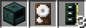
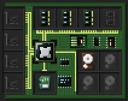
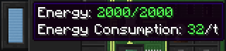
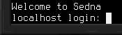

# 入门指南

本文介绍了让[电脑](block/computer.md)上电并运行所需的步骤，并包含使用电脑与设备进行交互的示例。

## 组装

首先，你需要一台现实中的电脑，以及一些组件。如果你还没有这些，先合成以下物品：

- 1x [电脑](block/computer.md)
- 1x **Linux**[硬盘](item/hard_drive.md)（先准备一个普通的8M硬盘，然后与[扳手](item/wrench.md)一起合成）
- 3x 8M[内存](item/memory.md)

获得所有组件后，放置电脑。使用扳手打开其物品栏。或者打开终端界面，然后使用左侧的切换按钮切换到物品栏界面。在此界面将硬盘和内存放入电脑中。

## 启动

要启动你刚刚组装的电脑，通常需要为其提供电力。查看终端或物品栏界面左侧的能量条。其提示文本会告诉你电脑当前储存的能量数，以及每tick维持运行所需的能耗数。

确保有足够的能量后，切换到终端界面，并点击左上角的电源按钮，或者在潜行状态下使用电脑。现在电脑应该引导启动了！请等待，直到电脑提示你登录。

输入`root`作为用户名并按回车进行登录。干得好，现在你有了一台可供使用的电脑！

你现在可以根据你的需求添加更多设备。请参阅手册的[脚本编写](scripting.md)条目以获取有关如何控制设备的信息。

祝你好运！最重要的是玩得开心！
