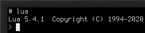
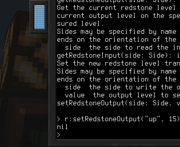

# 脚本编写

用Lua控制设备是使用[电脑](block/computer.md)的核心原则。许多设备是所谓的高级API（HLAPI）设备。这意味着它们不是通过常规的Linux驱动控制的，而是通过一个简单的RPC系统，通过串行设备传输JSON报文进行控制的。

## Devices 库

默认的Linux发行版包含了降低HLAPI设备访问难度的库。`devices`库提供了发现设备、调用设备方法以及获取设备文档（若有）的工具。

要使用`devices`库，可以通过`require("devices")`导入。

### 方法

`list():table` 返回当前所有可用设备的列表。返回的表中的每个条目代表一个设备，包括其类型名称和唯一标识符。

- 返回已连接的HLAPI设备列表。

`get(id:string):Device` 返回具有指定标识符的设备的封装对象。类似于`find`，但使用特定的标识符而不是类型名称。

- `id`为设备的唯一标识符。
- 返回指定设备的封装对象。

`find(typeName):Device` 返回指定类型的设备的封装对象。如果有多个同类型的设备，则无法确定会返回哪一个。可以使用[总线接口](block/bus_interface.md)中设置的别名。

- `typeName`为要查找设备的设备类型。
- 返回指定设备类型的设备封装对象。

`methods(id:string):table` 返回具有指定标识符的设备提供的方法列表。要以更易于阅读的方式获取方法列表，请获取设备封装对象并将其转换为字符串。此外，请参阅设备封装对象数据类型的章节。

- `id`为设备的唯一标识符。
- 返回设备提供的方法列表。
- 如果获取方法列表失败，将抛出错误。

`invoke(id:string, methodName:string, ...):any` 调用具有指定标识符的设备上的指定方法。传递所有额外参数。不建议直接使用此方法。最好获取设备封装对象并通过它调用方法。此外，请参阅设备封装对象类型部分。

- `id`为设备的唯一标识符。
- `methodName`为要调用的方法的名称。
- `...`为传递给方法的参数。
- 返回方法的结果。
- 如果调用失败或方法抛出异常，则抛出错误。

## 设备封装对象

从`device`库返回的设备是`Device`类型的对象。这是一个存储设备标识符的封装对象。

它的主要作用是无缝调用此设备对外暴露的方法，还能以便捷的方式访问文档（若有）。

要在这种封装对象上调用方法，请使用冒号加方法名。例如：  
`wrapper:someMethod(1, 2, 3)`

要获取设备的文档，可以将其用`tostring`转换为字符串。在Lua解释器中，可以用`=wrapper`。

## 示例

在此示例中，我们将控制一个[红石接口方块](block/redstone_interface.md)。首先，放置方块并使用[总线线缆](block/bus_cable.md)和[总线接口](block/bus_interface.md)将其连接到电脑。

我们在红石接口上方放置了一个红石灯，以便通过视觉显示我们的命令是否生效。

要验证设备与电脑之间的连接，在命令行中运行命令`lsdev.lua`。这将列出所有已连接的HLAPI设备的标识符和类型名称。其中一个的其类型名称应包含`redstone`。

在命令行中运行`lua`以交互编程模式启动Lua。

导入devices库并将其存储在名为`d`的变量中：
`d = require("devices")`

然后获取红石接口的`Device`封装对象，并将其存储在名为`r`的变量中：
`r = d:find("redstone")`

该次调用中的`redstone`为设备类型名称，与我们刚刚使用`lsdev.lua`查看的一样。

现在我们有了一个红石接口的封装对象，可以在其上调用方法。要获取可用方法的列表，运行`=r`。

在我们的示例中，我们对`setRedstoneOutput`方法感兴趣。它可以设置红石接口发出的信号。

要点亮我们的灯，我们希望从红石接口的顶面发出红石信号：  
`r:setRedstoneOutput("up", 15)`

现在灯应该会亮起来！

通过此示例，你了解了如何获取已连接设备的名称、它们提供的方法以及如何获取它们的文档。请继续尝试使用红石接口提供的其他方法读取输入的红石信号，或尝试其他设备吧！
